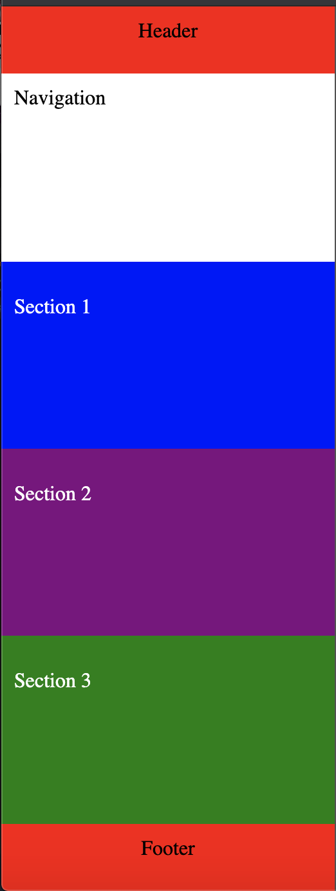
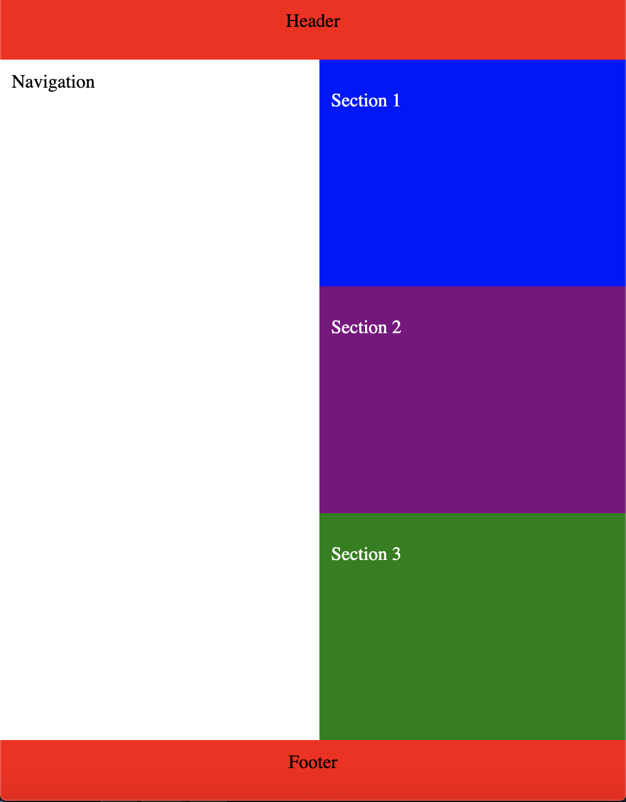
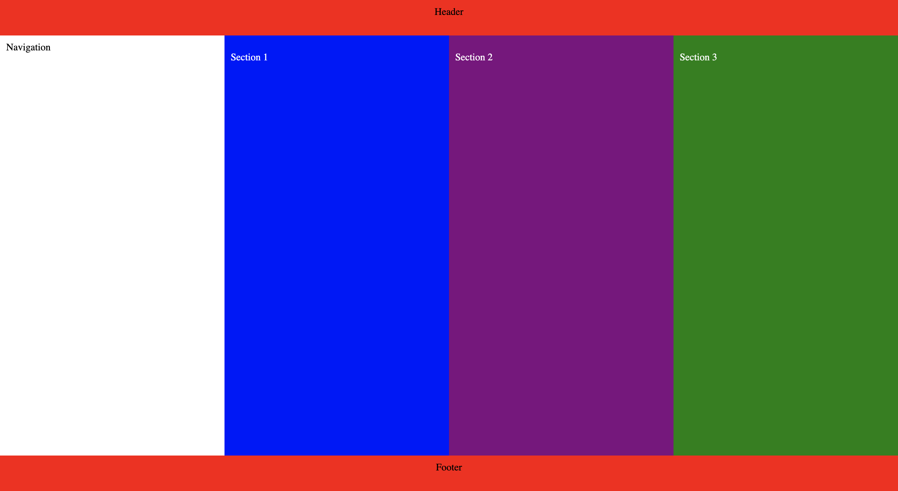

## Responsive Columns: Media Queries
In this exercise, you're going to convert a layout which was designed for mobile to also work on tablet and desktop browsers.

1.  For screens 480 pixels or larger:
    *   allow items within an `<article>` element to wrap (flow side-by-side if there is space, and flow top-to-bottom if there isn't space)
    *   force the `<aside>` element (sidebar) to take up 100% of its parent's height (hint: look into `flex: none;`)
2.  For screens 640 pixels for larger:
    *   `<section>` element should also take up 100% of their parent's height

When done correctly, the tablet view (>=480 pixels) should have a full-height `<aside>` and one column of `<section>` elements. Conversely, the desktop view (>=640 pixels) should have an `<aside>` element and `<section>` elements that fit on a single row.

To test your layout, it may be helpful to use your chrome devtools [device mode](https://developers.google.com/web/tools/chrome-devtools/device-mode). Be careful though, some devices have different pixel ratios.

You could also test by zooming(cmd + on MacOS, ctrl + on windows) and then resizing your browser window.

## See below for example screenshots of a completed activity:

Screens under 480px:

Screens between 480 and 640px:

Screens over 640px:

